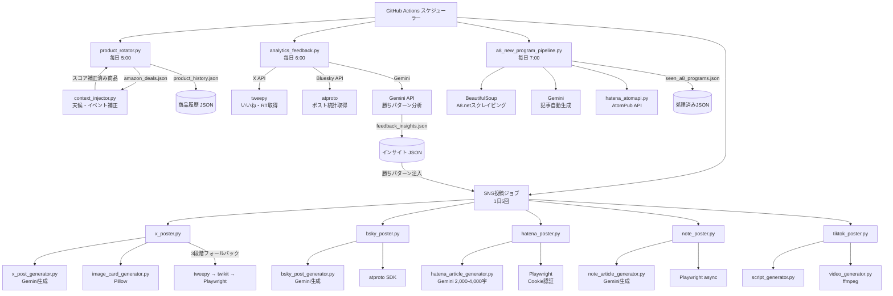
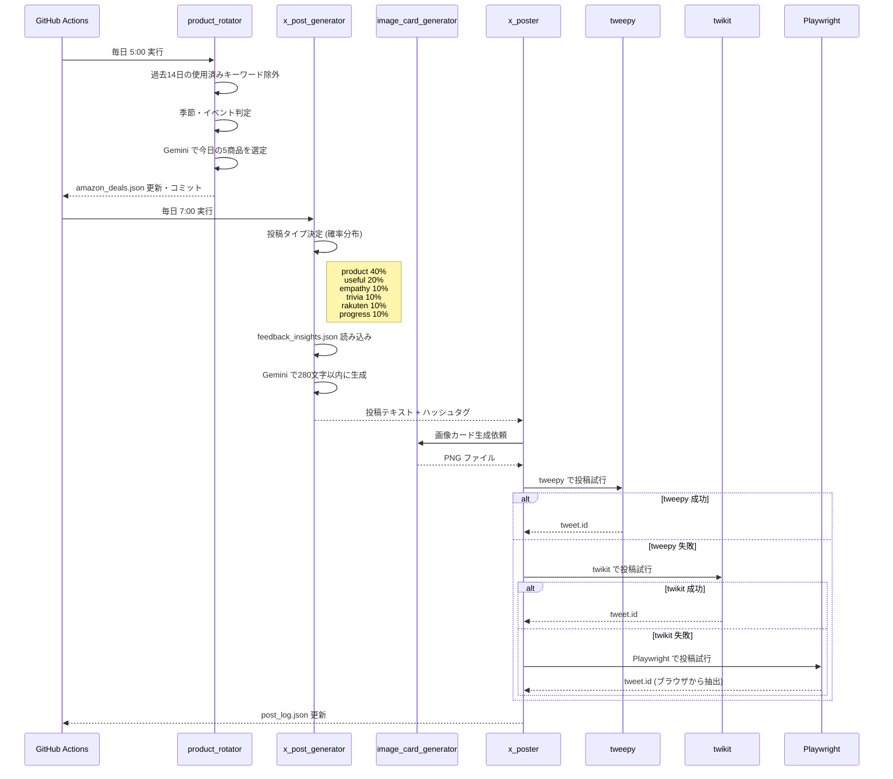
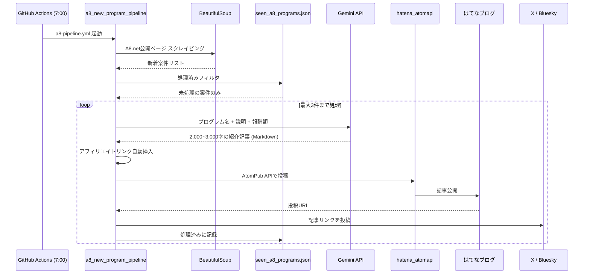
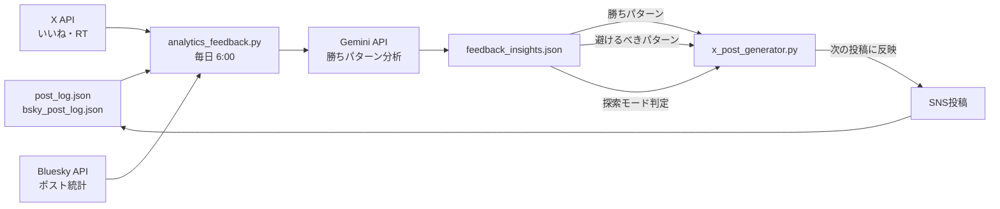
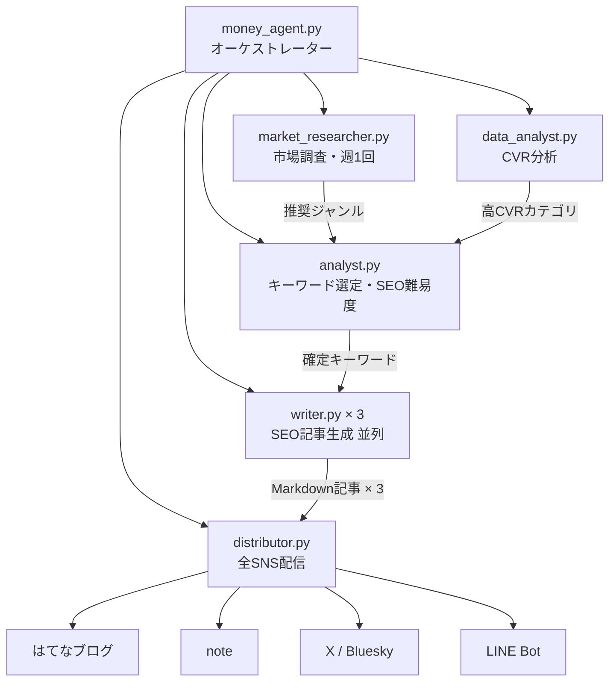

# SNSアフィリエイトシステム 全体設計書

> 最終更新: 2026-04-16

---

## 目次

1. [システム概要](#1-システム概要)
2. [ディレクトリ構造](#2-ディレクトリ構造)
3. [実行スケジュール全体像](#3-実行スケジュール全体像)
4. [データフロー図 (Mermaid)](#4-データフロー図-mermaid)
5. [各スクリプトの役割](#5-各スクリプトの役割)
6. [依存関係マップ](#6-依存関係マップ)
7. [アフィリエイト連携の仕組み](#7-アフィリエイト連携の仕組み)
8. [エラーハンドリング戦略](#8-エラーハンドリング戦略)
9. [収益化構造](#9-収益化構造)
10. [ボトルネック分析](#10-ボトルネック分析)

---

## 1. システム概要

**目標**: SNS自動投稿 × アフィリエイトで月10万円を達成する完全自律エージェントシステム。

```
┌─────────────────────────────────────────────────────────────────────┐
│  コンテンツ生成 (Gemini API)                                        │
│  ↓                                                                  │
│  SNS自動投稿 (X / Bluesky / はてなブログ / note / 楽天ルーム)       │
│  ↓                                                                  │
│  データ分析 (SNSメトリクス → フィードバックループ)                  │
│  ↓                                                                  │
│  アフィリエイト成約 (A8.net / Amazon / 楽天)                        │
│                                                                     │
│  すべて GitHub Actions で自動実行 (1日10回以上の投稿)               │
└─────────────────────────────────────────────────────────────────────┘
```

**技術スタック**

| レイヤー | 使用技術 |
|---------|---------|
| コンテンツ生成 | Gemini API (gemini-2.0-flash-lite) |
| X投稿 | tweepy (公式) → twikit (非公式) → Playwright (最終手段) |
| Bluesky投稿 | atproto SDK |
| ブログ投稿 | Playwright (Cookie認証) / AtomPub API |
| スクレイピング | BeautifulSoup, requests |
| CI/CD | GitHub Actions (6ワークフロー) |
| データ永続化 | JSON ファイル / Supabase |
| 画像処理 | Pillow |
| 動画生成 | ffmpeg |

---

## 2. ディレクトリ構造

```
tiktok-lifehack/
├── .github/workflows/
│   ├── sns-post.yml           # メインフロー (X/Bluesky/note/はてな/楽天)
│   ├── a8-pipeline.yml        # A8.net新着案件パイプライン
│   ├── daily_rotate.yml       # Amazon商品ローテーション
│   ├── analytics.yml          # SNS分析・フィードバック
│   ├── money-agent.yml        # 月10万円エージェント
│   └── product-watcher.yml    # 商品監視
│
├── x_automation/              # X(Twitter) 自動投稿
│   ├── x_poster.py            # 投稿エンジン (3段階フォールバック)
│   ├── x_post_generator.py    # 投稿文生成 (Gemini + 100+テンプレート)
│   ├── product_rotator.py     # Amazon商品ローテーター
│   ├── context_injector.py    # コンテキスト動的注入 (天候・イベント)
│   ├── fetch_amazon_deals.py  # 購買意欲スコアリング
│   ├── generate_amazon_thread.py # 3ツイートスレッド生成
│   ├── image_card_generator.py   # X用画像カード生成
│   ├── engagement_analyzer.py    # エンゲージメント分析
│   └── x_browser_poster.py       # Playwright投稿 (最終フォールバック)
│
├── bluesky_automation/        # Bluesky 自動投稿
│   ├── bsky_poster.py
│   └── bsky_post_generator.py
│
├── hatena_automation/         # はてなブログ 自動投稿
│   ├── hatena_poster.py
│   └── hatena_article_generator.py
│
├── note_automation/           # note 自動投稿
│   ├── note_poster.py
│   └── note_article_generator.py
│
├── rakuten_room/              # 楽天ルーム アフィリエイト
│   ├── main.py
│   ├── product_fetcher.py
│   ├── review_generator.py
│   └── room_poster.py
│
├── money_agent/               # 月10万円エージェント
│   ├── a8_new_program_pipeline.py
│   ├── a8_approved_auto.py
│   ├── money_agent.py
│   ├── analytics_feedback.py
│   ├── hatena_atomapi.py
│   ├── a8_report_collector.py
│   ├── agents/
│   │   ├── market_researcher.py
│   │   ├── analyst.py
│   │   ├── writer.py
│   │   ├── data_analyst.py
│   │   └── distributor.py
│   └── config/
│       ├── affiliate_links.json
│       └── update_affiliate.py
│
├── tiktok_automation/         # ショート動画
│   ├── tiktok_poster.py
│   ├── script_generator.py
│   └── video_generator.py
│
├── output/                    # 生成物・ログ
│   ├── product_shorts/
│   ├── img_cache/
│   └── audio_cache/
│
├── .env                       # 認証情報・APIキー
└── requirements.txt
```

---

## 3. 実行スケジュール全体像

| JST時刻 | ワークフロー | 実行内容 |
|---------|-------------|---------|
| 5:00 | `sns-post.yml` | Amazon商品ローテーション (product_rotator.py) |
| 6:00 | `analytics.yml` | SNS分析 + feedback_insights.json 更新 |
| 7:00 | `a8-pipeline.yml` | A8.net新着案件 → 記事化 → はてなブログ投稿 |
| 7:00 / 11:00 / 15:00 / 19:00 / 23:00 | `sns-post.yml` | X・Bluesky・はてなブログ・note 投稿 |
| 7:45 / 11:45 / 15:45 / 19:45 / 23:45 | `sns-post.yml` | ショート動画投稿 |
| 12:00 | `sns-post.yml` | 楽天ルーム投稿 (1商品/日) |
| 毎月1日 9:00 | `a8-pipeline.yml` | A8.net月間収益レポート集計 |

---

## 4. データフロー図 (Mermaid)

### 4-1. 全体フローチャート



### 4-2. X投稿 詳細シーケンス図



### 4-3. A8.net アフィリエイトパイプライン



### 4-4. フィードバックループ



### 4-5. 月10万円エージェント マルチエージェント構成



---

## 5. 各スクリプトの役割

### X(Twitter) 自動投稿系

| スクリプト | 役割 | 主な入力 | 主な出力 |
|-----------|------|---------|---------|
| `x_poster.py` | 投稿エンジン (3段階フォールバック) | 生成テキスト・画像 | 投稿ID / post_log.json |
| `x_post_generator.py` | 投稿文生成 (Gemini + 100+テンプレート) | テンプレート / amazon_deals.json / feedback_insights.json | 投稿テキスト・ハッシュタグ |
| `product_rotator.py` | Amazon商品ローテーター (季節対応) | Gemini API / product_history.json | amazon_deals.json |
| `context_injector.py` | コンテキスト動的注入 (天候・給料日・イベント) | Open-Meteo天候API | スコア補正値 (+10〜+20) |
| `fetch_amazon_deals.py` | 購買意欲スコアリング | amazon_deals.json | intent_score (0〜100) |
| `generate_amazon_thread.py` | Amazon 3ツイートスレッド生成 | 商品データ | tweet1 / tweet2 / tweet3 |
| `image_card_generator.py` | X用画像カード生成 | 投稿テキスト | PNG画像ファイル |
| `engagement_analyzer.py` | エンゲージメント分析 | post_log.json | 勝ちパターン・避けるべきパターン |
| `x_browser_poster.py` | Playwright ブラウザ投稿 (最終フォールバック) | 投稿テキスト | 投稿成功/エラー |

### Bluesky 自動投稿系

| スクリプト | 役割 | 主な入力 | 主な出力 |
|-----------|------|---------|---------|
| `bsky_poster.py` | Bluesky投稿エンジン | 生成テキスト | 投稿URI / bsky_post_log.json |
| `bsky_post_generator.py` | Bluesky投稿文生成 (Build in Public 50%) | テンプレート30+ | Bluesky投稿テキスト (100〜200字) |

### ブログ記事投稿系

| スクリプト | 役割 | 主な入力 | 主な出力 |
|-----------|------|---------|---------|
| `hatena_poster.py` | はてなブログ投稿 (Playwright Cookie認証) | 生成記事 | 投稿URL / hatena_post_log.json |
| `hatena_article_generator.py` | SEO記事生成 (2,000〜4,000字) | キーワード / Gemini | Markdown記事 |
| `note_poster.py` | note投稿 (Playwright async) | 生成記事 | 投稿URL / note_post_log.json |
| `note_article_generator.py` | note記事生成 | キーワード / Gemini | Markdown記事 |

### A8.netアフィリエイト系

| スクリプト | 役割 | 主な入力 | 主な出力 |
|-----------|------|---------|---------|
| `a8_new_program_pipeline.py` | 新着案件 → 記事化 → 投稿 | A8.netスクレイピング / Gemini | はてなブログ記事 |
| `a8_approved_auto.py` | 承認済みプログラム自動処理 (最大5件/回) | A8.netログイン / Gemini | 記事生成・投稿 |
| `a8_report_collector.py` | 収益レポート集計 | Gmail IMAP (A8通知) | a8_report.json / CSV |

### 楽天ルーム系

| スクリプト | 役割 | 主な入力 | 主な出力 |
|-----------|------|---------|---------|
| `rakuten_room/main.py` | 楽天ルーム投稿メイン | --count 引数 | post_log.json |
| `product_fetcher.py` | 楽天商品取得 | Rakuten API | 商品データ[] |
| `review_generator.py` | ガチレビュー生成 (ペルソナ: 20代男性) | 商品データ | コメント / ハッシュタグ |
| `room_poster.py` | 楽天ルーム投稿 (Playwright) | レビューテキスト | 投稿成功/URL |

### 分析・レポーティング系

| スクリプト | 役割 | 主な入力 | 主な出力 |
|-----------|------|---------|---------|
| `analytics_feedback.py` | SNS分析 & フィードバックループ | post_log / X API / Bluesky API | feedback_insights.json |
| `engagement_analyzer.py` | エンゲージメント詳細分析 | post_log.json | 勝ちパターン・避けるべきパターン |

### 月10万円エージェント系

| スクリプト | 役割 |
|-----------|------|
| `money_agent.py` | メインオーケストレーター (5エージェント統制) |
| `agents/market_researcher.py` | 市場調査 (トレンド + ASP案件 + ライバル分析) |
| `agents/analyst.py` | キーワード選定 + SEO難易度判定 |
| `agents/writer.py` | SEO記事執筆 (×3並列・失敗談20%必須) |
| `agents/data_analyst.py` | CVR分析・次の集中投下ジャンル推奨 |
| `agents/distributor.py` | 全SNS配信オーケストレーター |

---

## 6. 依存関係マップ

```
x_poster.py
├── x_post_generator.py
│   ├── Gemini API
│   ├── feedback_insights.json
│   ├── amazon_deals.json
│   └── generate_amazon_product_post()
├── generate_amazon_thread.py  → Gemini API
├── image_card_generator.py    → PIL (Pillow)
├── x_browser_poster.py        → Playwright
└── tweepy / twikit

product_rotator.py
├── Gemini API
├── product_history.json
├── static_products.json
├── fetch_amazon_deals.py      → score_purchase_intent()
└── context_injector.py        → Open-Meteo API

hatena_article_generator.py
├── Gemini API
├── ARTICLE_THEMES (内部定義)
├── affiliate_links.json
└── feedback_insights.json (optional)

a8_new_program_pipeline.py
├── BeautifulSoup + requests
├── Gemini API
├── hatena_atomapi.py          → requests (AtomPub)
└── seen_a8_programs.json

money_agent.py
├── agents/market_researcher.py
├── agents/analyst.py
├── agents/writer.py (×3並列)
├── agents/data_analyst.py
├── agents/distributor.py
└── revenue_tracker.py

analytics_feedback.py
├── tweepy (X API)
├── atproto (Bluesky API)
├── Gemini API
├── Bitly API
├── Supabase
└── engagement_analyzer.py
```

---

## 7. アフィリエイト連携の仕組み

### Amazon アフィリエイト

- **商品選定**: `product_rotator.py` が Gemini + 季節・イベントコンテキストで毎日5商品を選定
- **リンク生成**: `https://www.amazon.co.jp/s?k={keyword}&tag={AMAZON_ASSOCIATE_TAG}`
- **スコアリング**: 購買意欲スコア (0〜100) をコンテキスト補正で調整
- **追跡**: Bitly短縮URL でクリック数追跡 → Supabase に記録

### A8.net アフィリエイト

- **新着案件取得**: 公開ページを BeautifulSoup でスクレイピング
- **承認済みプログラム**: A8.net に requests でログイン → EPC最高テキストリンクを取得
- **リンク管理**: `money_agent/config/affiliate_links.json` で一元管理
- **記事への自動挿入**: Gemini 生成時にプロンプトでリンク挿入ポイントを指定

### 楽天アフィリエイト

- **商品検索**: Rakuten Product API で「一人暮らし20代男性向け」商品を検索
- **リンク形式**: `https://hb.afl.rakuten.co.jp/hgc/{site_id}.{affiliate_id}/...`

### 投稿タイプ別 確率分布 (X)

| タイプ | 確率 | 内容 |
|-------|------|------|
| product | 40% | Amazon商品紹介 + アフィリリンク |
| useful | 20% | 役立つ情報 (リンク分離2ツイート) |
| empathy | 10% | 共感・体験 |
| trivia | 10% | 雑学・ネタ |
| rakuten | 10% | 楽天商品紹介 |
| progress | 10% | 収益進捗報告 |

---

## 8. エラーハンドリング戦略

### X投稿: 3段階フォールバック

```
第1段階: tweepy (公式API v2)
  ├─ 利点: 安定・メディア対応
  ├─ 欠点: APIキー必須・レート制限あり
  └─ 失敗時 → 第2段階へ

第2段階: twikit (非公式API)
  ├─ 利点: Cookie のみで投稿可 / APIキー不要
  ├─ 欠点: API仕様変更リスク
  └─ 失敗時 → 第3段階へ

第3段階: Playwright ブラウザ自動化 (最終手段)
  ├─ 利点: 完全無料 / ほぼ確実
  └─ 欠点: 遅い (3〜10秒) / メディアなし
```

### Gemini APIレート制限: 指数バックオフ

```python
wait_time = 2 ** retry_count  # 1, 2, 4, 8, 16... 秒
```

`a8_approved_auto.py` で実装済み。その他スクリプトへの適用は不均一。

### Cookie認証の期限切れ対応

- はてなブログ / note / 楽天ルーム は GitHub Actions の `cache` で Cookie ファイルを保持
- Cookie 失効時は手動更新が必要 (自動更新なし)

---

## 9. 収益化構造

| チャネル | 月間目標 | 主な収益源 |
|---------|---------|---------|
| はてなブログ SEO × A8.net | 7万円 | クラウド会計・証券・プログラミングスクール |
| note 無料記事 × アフィリ | 2万円 | はてなブログ記事の転用 |
| 楽天ルーム × レビュー | 1万円 | 生活雑貨・ガジェット |
| Amazon アフィリ (X投稿) | 補助 | 衝動買いゾーン (2,000〜20,000円) |
| **合計** | **10万円** | |

**コンバージョンフロー**

```
SEO検索 / SNSシェア → はてなブログ記事 → アフィリリンク → 成約
                    ↓
                   note → アフィリリンク → 成約
                    ↓
                LINE Bot → 高額商品誘導 → 成約
```

---

## 10. ボトルネック分析

### エラー耐性

| # | 箇所 | リスク | 重要度 |
|---|------|-------|-------|
| 1 | Cookie認証 (はてなブログ・note・楽天ルーム) | Cookie失効で全投稿停止。自動更新なし | 高 |
| 2 | twikit の非公式API依存 | X社のAPI変更で突然動作停止 | 高 |
| 3 | A8.netスクレイピング | HTML構造変更で取得失敗。ページネーション非対応 | 高 |
| 4 | Gemini APIエラー伝播 | 一部スクリプトに指数バックオフなし → 502エラーで即終了 | 中 |
| 5 | Playwright の GitHub Actions 実行 | ブラウザ起動失敗が頻発しやすい。screenshot保存で原因追跡はできるが復旧手段なし | 中 |

### スケーラビリティ

| # | 箇所 | リスク | 重要度 |
|---|------|-------|-------|
| 6 | JSONファイルによる状態管理 | 並列ジョブが同一JSONを同時書き込みすると競合 (Git push も絡む) | 高 |
| 7 | product_history.json の肥大化 | 14日より古いエントリを削除する仕組みが未確認。長期運用でファイルサイズ増大 | 中 |
| 8 | 投稿ログ (post_log.json) の無制限蓄積 | ローテーションなし。数百件を超えると分析コストが増大 | 中 |
| 9 | Gemini コンテキスト長 | analytics_feedback.py が全ログを1プロンプトに詰めると上限超過のリスク | 中 |
| 10 | money_agent の writer.py ×3 並列 | Gemini APIの同時リクエスト数に制限あり。429 Too Many Requests が出やすい | 中 |

### API制限対策

| # | 箇所 | リスク | 重要度 |
|---|------|-------|-------|
| 11 | X API Free tier の月間制限 | Free tier は読み取り制限が厳しい。analytics で tweepy による取得がブロックされやすい | 高 |
| 12 | Gemini API の 1分間リクエスト制限 | 1日10回以上のジョブが短時間に集中すると制限到達。ジョブ間にsleep未挿入のスクリプトあり | 高 |
| 13 | Bitly API の月間クリック取得制限 | 無料プランは月間クリック数取得に上限あり | 低 |
| 14 | Open-Meteo API | 無料だがリクエスト頻度に注意。product_rotator が毎日呼び出し | 低 |

### 優先修正推奨

```
優先度 高:
  1. Cookie自動更新 or AtomPub API への完全移行 (はてなブログ)
  2. 全スクリプトへの指数バックオフ統一実装
  3. JSONファイル競合対策 (ファイルロック or Supabase への移行)
  4. X API レート制限対策 (analytics での取得件数制限)

優先度 中:
  5. post_log.json のローテーション実装 (最新N件のみ保持)
  6. Gemini プロンプトへのログ渡し方を要約形式に変更
  7. a8_approved_auto.py の並列処理リトライ強化

優先度 低:
  8. product_history.json の自動クリーンアップ
  9. Playwright ジョブの GitHub Actions タイムアウト設定
```
